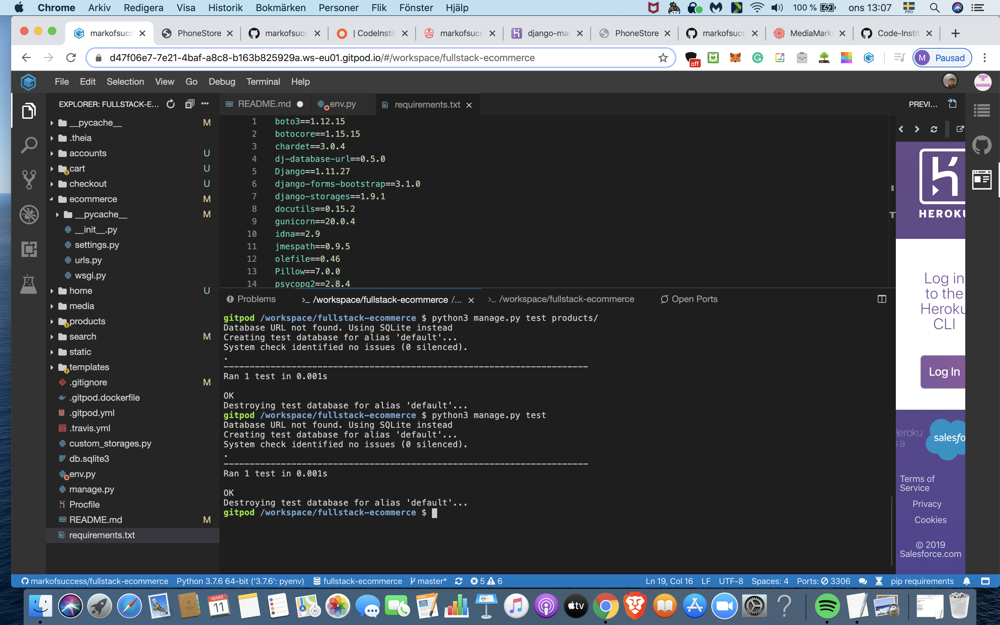
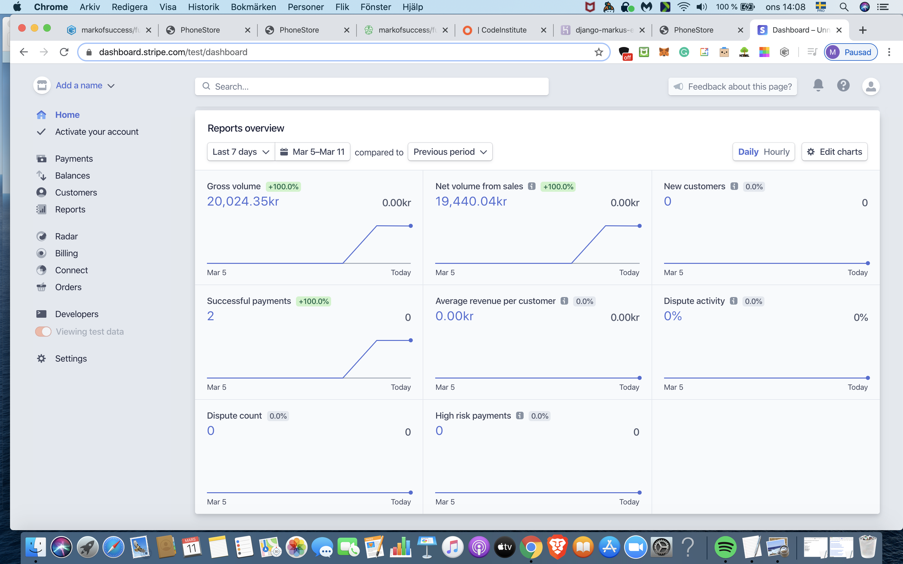
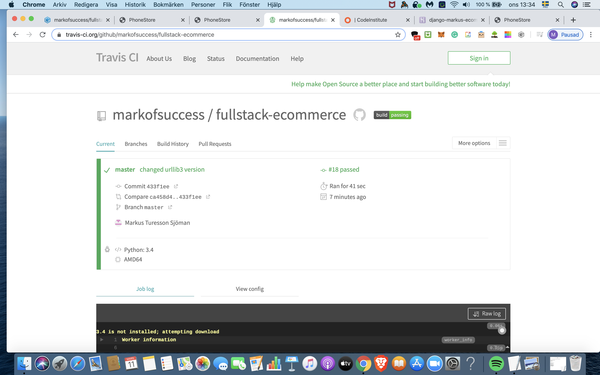

# Executive Summary of The Website

The last milestone project for my school [Code Insitute](https://codeinstitute.net/). A Full-Stack Django Frameworks ecommerce site where users can browse for smartphones and make an order if the want with Stripe payment option integrated. You can try and make an order by registering as an user and at the checkout form you can put in the card number 4242424242424242 and 123 as the CVV number. Databases are stored with Postgres and SQlite. Stripe Test API is used for this project as no real products are sold. See the live site [here](https://django-markus-ecommerce.herokuapp.com/)

## The Goal & Purpose of The Website

### The Goal

* The End Goal of the website is to sell smartphones and make it an easy and simple way for the customer to do so.

 There are many smartphones on the page, the customer can inspect each and one of them by clicking on more details to see specifications and pictures of each smartphone. There the customer can choose to add the product to the cart by pressin add to cart or press continue shopping if he/she wants to continue browsing other smartphones.

 Customers can choose what smartphones they like and put in the quantity they want and its added to the cart. If they like to proceeed with the purchase, they press on the cart icon in the navbar and then the checkout button to come to the checkout form. If the customers like to remove a product from the cart, they press on the cart in the navbar and then press the ammend button and choose quanitity.

### Purpose

* The purpose of the website is to show how with Django frameworks, Python and Stripe API you can create an fully functional e-commerce site where the business owner can host their ecommerce shop with an secure  and well known payment processor as Stripe.

# UX

The website is for visitors who are intrested in smartphones and purchasing smartphones.

* As a user, I want to know more about a specific smartphone and its specifications by pressing on    the more details button. And by pressing on each product image, the image is zoomed in to make it   larger.

* As a user, I want to search the site for a specific smartphone that I'm intrested in.

* As a user, I can register an unique profile with a unique profile name by clicking on the           register icon in the navbar.

* As s user, I can choose between logging in with my username or email address by clicking on the     login button in the navbar.

* As a user, I want to make an secure payment with a well known and secure payment provider as        Stripe.

* As a user, I want to be able to ammend a product if I regret adding it to the cart, by pressing     the ammend button in the cart page.

* As a user, I can retrieve the password to my profile if I forgot it by pressing on the forgot my    password link in the login page.

* As a user, I can see how much a product costs, all prices of each product are specified in Euro     under each item, and at the checkout you can see the total amount stated in Euro.

* As a user, I can add a product to the cart by choosing the quantity and pressin on the add button.

* As a user, the only way to purchase a product is by logging in/ register a new user.

* As a user, I can watch the carousel images displaying different smartphones in a bigger frame.

## Design

* The design is a simple with all content & products on 1 page. The navbar has register, login and    cart icons. The smartphone logo takes you back to the homepage. There is a search bar where users   can search for items. Added carousel images of different smartphones making it more interactive     for the user. The footer has icons of all the payments details avaiable on the page.

## Mockup

* The mockup was partly inspired by my [third milestone project](https://python-mobilephone-review.herokuapp.com/) and the rest was designed throughout the project.

# Features

## Existing Features

* The user can search any product by using the search bar.
* The user can add any product they like by choosing quantity and clicking the add button.
* The user can press on the more details button on each item to find out more information about the   product.
* The user can register and profile by clicking on register icon in the navbar.
* The user can login with their email or username by clicking on the login icon in the navbar.
* The user can inspect the cart by clicking on the cart icon the navbar.
* The user can ammend any product by clicking the ammend button in the cart page.
* The user can checkout by pressin on the checkout button in the cart page.
* The user can log out by pressing the log out button in the navbar.
* The user can make an purchase by clicking on the submit a payment in the checkout page.
* The user can press on each product image to increase the size of it in the product details page.
* The user can retrieve their password by clicking on the forgot my password link in the login page.

## Features Left to Impelemt

* Adding more product categories such as tables and computers
* Creating a contact page for users to get in contact.
* Styling the page more interactive and responsive.

## Techonologies & Languages Used

* [HTML5](https://developer.mozilla.org/en-US/docs/Web/Guide/HTML/HTML5)

* [CSS3](https://developer.mozilla.org/en-US/docs/Archive/CSS3)
- Boostrap was used mainly to make the website responsive on multiple devices using bootstrap grid.   
* [JavaScript](https://developer.mozilla.org/en-US/docs/Web/JavaScript)
- Stripe JavaScript was used to render the payment processing.

* [Gitpod](https://www.gitpod.io/)
- Gitpod was the platform used to code the whole project with.

* [jQuery](https://jquery.com/)
- The project uses JQuery to simplify DOM manipulation.

* [Github](https://github.com/)
- Github was used to document the project progress.

* [HTML Validator](https://validator.w3.org/)
- This was used to validate the HTML code.

* [HTML Formatter](https://htmlformatter.com/)
- This was used for formatting the HTMl code.

* [Stripe](https://stripe.com/)
- Stripe is used for to make payments securely on any products on the page.

* [Materialize](https://materializecss.com/)
- Materialize was used for the materialize box image class, when pressing on the product details      images to    increase the size of it.

* [Postgres](https://www.postgresql.org/)/ [Sqlite3](https://www.sqlite.org/index.html)
- These were used for storing Databases.

* [Heroku](www.heroku.com)
- Heroku was used for hosting the web page.

* [Django](https://www.djangoproject.com/)
- Django frameworks were used for this project.

* [Python3](https://www.python.org/)
- Python3 was used for this project.

* [Font Awesome](https://fontawesome.com/)
- Font Awesome was used to style the fonts/icons of the page.

* [Chrome Devtools](https://developers.google.com/web/tools/chrome-devtools)
- Google Chrome Devtools was used for inspecting webpage for any errors and used for designing the    page in a faster way.

* [AWS](aws.amazon.com/)
‎- Amazon Web Services was used to host the media and static files for the project.

* [Boto3](https://boto3.amazonaws.com/v1/documentation/api/latest/index.html)
- Creation, configuration and management of AWS S3 Bucket.
‎
* [Gunicorn](https://pypi.org/project/gunicorn/)
- Gunicorn ‘Green Unicorn’ is a Python WSGI HTTP Server for UNIX to assist the deployment of Django   projects to Heroku.

* [Pip](https://pip.pypa.io/en/stable/installing/)
- Used to install tools for the project.

* [Pillow](https://pillow.readthedocs.io/en/stable/)
- Python image library to help process images files to store in databases.

* django-forms-bootstrap
- This was used for styling Django Forms.

* [psycopg2](https://pypi.org/project/psycopg2/) 
- Psycopg the most popular PostgreSQL database adapter was used for Python.

# Testing

## Broswers

* The website was tested on the Google Chrome browser, Safari, Firefox Quantum and Brave broswer to make sure that everything loaded smoothly and looked proper across different browsers.

* Google Chrome Version 76.0.3809.132

* Brave Version 0.61.52 Chromium: 73.0.3683.86

* Safari Version 12.1.2 (14607.3.9)

* Firefox Quantum version 69.01

* Samsung Internet Browser on Samsung Galaxy S10, Version 10.1.00.27

* Chrome Broswer on Samsung Galaxy S10, version 77.0.3865.92

* Brave Broswer on Samsung Galaxy S10, Chromium 80.0.3987.119

## Responsivness

* The site was tested on multiple devices using Google chrome developer tools to see the responsivness for different media devices. The devices that were tested were: Samsung S5, Samsung Galaxy s10, iPhone X, iPhone 5/6/7/8, iPhone 6/7/8 Plus, iPad and iPad Pro.

## Tests.py

* The tests.py file was test and test were successful as you can see in the picture below. The Database URL not found, used SQLite instead.

## Registration & Login

* Created multiple accounts and used the Django admin panel to see if users have been registered.
* After Register and logging in there should pop up a green message either "you have succssfully      registered" or "you have successfully logged in". 
* Click on the profile icon to see what email address you are logged in with.
* Once registered and logged in you can proceed to the checkout form.
* If not logged in you can add items to the cart but you can't proceed to the checkout without        logging in.
* You can succesfully log in with both username and email.

## Log out

* When clicking log out - a pop message with "You have successfully logged out" appears.
* If trying to checkout from cart logged out - you will be redirected to log in page.

## Reset Password Function

## Products

* If trying to click add on a product without specifying quantity - pop up with this field is         required.
* When clicking on more details button - redirected succsfully to that item page.
* In the product details page - you need to specify amount in order to add to cart. 
* When clicked on continue shopping - gets redirected to products page.
* Clicking on product image to see if it image increases.
* In the Django Admin Panel - Check if edit/delete Product and Product images are possible. 

## Submit Payment & Ammend

* At the checout form, if any field is missing and you try to submit payment, pop up messsage with    fil in this field is required.
* Amend a item in the cart by choosing quantity 1 to delete item from cart.
* In the Django Admin Panel - Checkout - Orders to see all succesful orders registered.
* Once filled in the checkout form and clicked submit payment, a pop up message with "You have        succesfully paid" shows up. Also checked my Stripe dashboard for succesful payments. See            picture below:

## Travis 

* Travis was used to scan packages and libraries for bugs and anything that might damage travis or the server, to ensure that that server is safe and free of code that might be dangerous. All tests were passed, see the green build passing button in top of the README file and see pictures below:

Travis Joblog:

## Bugs

* After doing a search or submit payment it redirects to products page but carousel images not        displaying.

## Code Validators

* The CSS and HTML code was validated using validators.

# Deployment

* App is running and hosted live on [Heroku](https://django-markus-ecommerce.herokuapp.com/)

## Steps to Deployment

Ensure you have the following tools: 

An IDE such as [Gitpod](https://www.gitpod.io/)

You must have these installed on your machine:

* [Python3](https://www.python.org/downloads/)
* [PIP](https://pip.pypa.io/en/stable/installing/)
* [Git](https://gist.github.com/derhuerst/1b15ff4652a867391f03)

To allow you to access all functionality on the site locally, ensure you have created free accounts with the following services:

* [Stripe](https://dashboard.stripe.com/register)
* [AWS](https://aws.amazon.com/)
* [Setup an AWS S3 Bucket](https://docs.aws.amazon.com/AmazonS3/latest/gsg/CreatingABucket.html)

1. Clone this repository:
    git clone https://github.com/markofsuccess/fullstack-ecommerce.git

2. Install all libraries from requirements.txt:
    pip3 -r requirements.txt

3. Create a env.py file and set up environment variables:

    os.environ.setdefault('SECRET_KEY', <key here>)

    os.environ.setdefault('STRIPE_PUBLISHABLE', <key here>)

    os.environ.setdefault('STRIPE_SECRET', <key here>)

    os.environ.setdefault('AWS_ACCESS_KEY_ID', <key here>)

    os.environ.setdefault('AWS_SECRET_ACCESS_KEY', <key here>)

4. Add the env.py to .gitignore file with command:
    echo env.py >> .gitignore

    Also add SQlite databases for development mode to .gitignore:
        echo .sqlite3 >> .gitignore

5. In setting.py file - Line 90 - we have a if statement that checks if we are in dev mode:
    if "DATABASE_URL" in os.environ:
    DATABASES = {'default': dj_database_url.parse(os.environ.get('DATABASE_URL'))}
else:
    print("Database URL not found. Using SQLite instead")
    DATABASES = {
        'default': {
            'ENGINE': 'django.db.backends.sqlite3',
            'NAME': os.path.join(BASE_DIR, 'db.sqlite3'),
        }
    }

6. Migrate the models to create the database tables
    python manage.py migrate

7. Create a superuser account so you can access the Django Admin Panel
    python3 manage.py createsuperuser

8. You can now run the program locally with the following command:
    python3 manage.py runserver

9. You can now add in the Django Admin Panel:

* Products
* Product_images

## Heroku

To deploy the project to Heroku, complete the following:

1. Create a new requirements.txt:
    pip3 freeze > requirements.txt

2. Create a Procfile:
    echo web: gunicorn ecommerce.wsgi:application > Procfile

3. Commit and push any changes to your Github repo:
    git add .
    git commit -m "you commit message"
    git push origin master

4. Create an app in your Heroku dashboard. Choose a unique name, and choose the region where you would like your app located.

5. In your apps dashboard, click the "Deploy" tab, look for "Deployment Method" section and select Github.

6. Select your Github repository that you have just pushed to.

7. Click the "Resources" tab, look for "Add-ons" section and add a Heroku Postgres - Hobby Dev database to your app. Copy the 

8. Click the "Settings" tab, and look for "Config Vars" section and click the "Reveal Config Vars" section.

9. Set the following config vars:

    Key                     < Value >

    AWS_ACCESS_KEY_ID	    < your access key >

    AWS_SECRET_ACCESS_KEY	< your secret key >

    DATABASE_URL	        < your postgres database url >

    SECRET_KEY	            < your secret key >

    STRIPE_PUBLISHABLE	    < your secret key >

    STRIPE_SECRET	        < your secret key >

    DISABLE_COLLECTSTATIC   <1>

10. Add your postgress database url to your env.py file:

    os.environ.setdefault("DATABASE_URL", "postgres://your postgres url")

11. From the command line of your local IDE:

* Migrate the database models
* Create your superuser account in your new database

12. In your Heroku dashboard - click the "Deploy" tab, go down to the "Manual Deploy" section, select the master branch of your repo, and "Deploy Branch".

13. Dont forget to add your Heroku app url to the settings.py file:

    ALLOWED HOSTS = ['your_heroku_app_name_url']

14. In the Django Admin panel - log in with your superuser account and create new products and product images.

# Credits

## Content
* The images on all the smartphones were from [MediaMarkt](https://www.mediamarkt.se/)
* The Profile Registration & Log in functions was used from the Code Institute course lesson [Authentication & Authorisation](https://courses.codeinstitute.net/courses/course-v1:CodeInstitute+F101+2017_T1/courseware/c237a0c4183442698c6602454dbf011a/5434e9d235c844678d18d4d05bf9f63c/?activate_block_id=block-v1%3ACodeInstitute%2BF101%2B2017_T1%2Btype%40sequential%2Bblock%405434e9d235c844678d18d4d05bf9f63c)
* Parts of the design and wiring of the project was learned from the Code Institute course lesson [Putting It All Together | ECommerce Mini Project](https://courses.codeinstitute.net/courses/course-v1:CodeInstitute+F101+2017_T1/courseware/c95cdb47b7bb40e49bbfb75cb4c29114/01fbdaedba5d4db19ad118cbe07c1ab7/?activate_block_id=block-v1%3ACodeInstitute%2BF101%2B2017_T1%2Btype%40sequential%2Bblock%4001fbdaedba5d4db19ad118cbe07c1ab7)

## Aknowledgements

* Thanks to all the great tutors on Code institute for being a great support through the entire       course, without your great support and tips it would probably take 5 years for me to complete the   course :D
* Thanks to my Mentor Antonia Simic for helping me with the projects.
* Thanks to my school [Code Institute](https://codeinstitute.net/) for creating a great Full-Stack    Developer Education.